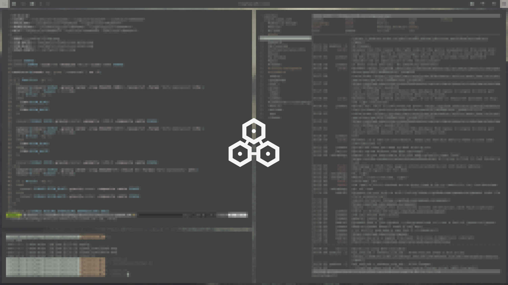
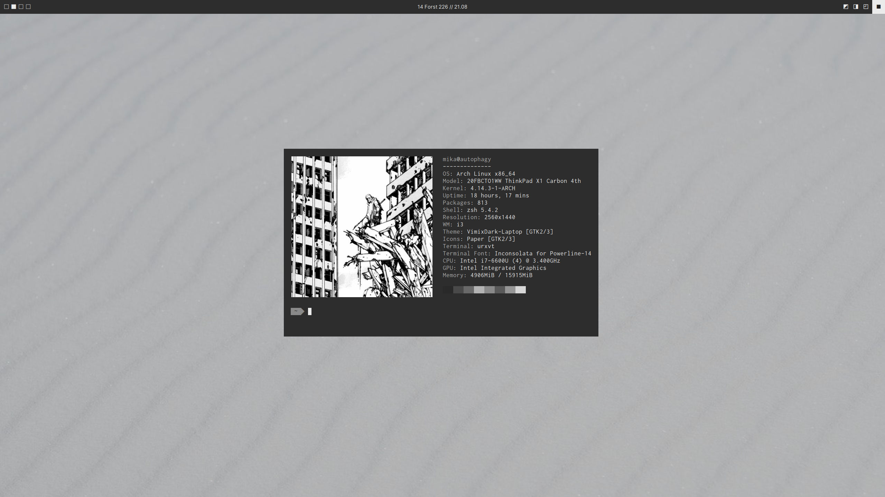
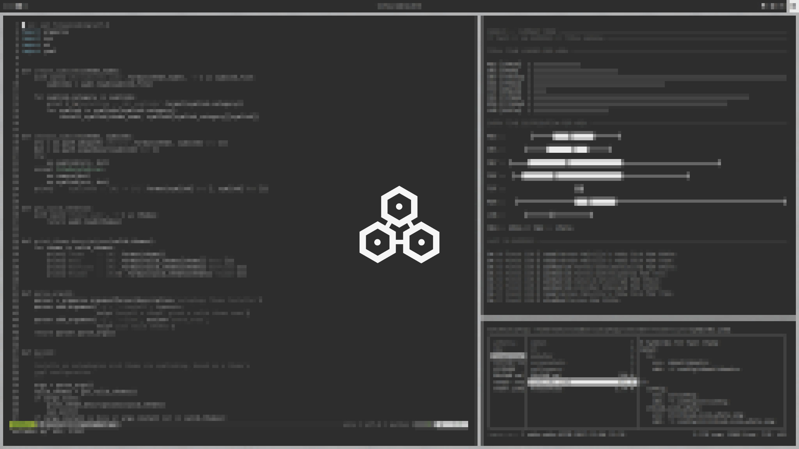

Dotfiles for [Arch Linux](https://www.archlinux.org/) themes, all based around
the use of the [i3wm-gaps](https://github.com/Airblader/i3) window manager.

## Themes

### 0x01 :: Arboria
#### Clean


#### Busy


#### Lock Screen



Elements :: i3wm // polybar // dunst

[Arboria README](arboria/README.md)

### 0x02 :: Feówerscýte
#### Clean



#### Busy


#### Lock Screen



Elements :: i3wm // polybar // dunst

[Feówerscýte README](feowerscyte/README.md)

## Installation

Theme installation is done via `install.py`. To set up:

```
virtualenv -p python3 .venv
.venv/bin/pip install -r requirements.txt
```

To list valid themes:

```
.venv/bin/python antimber.py -l
```

To install a theme (for example, arboria):

```
.venv/bin/python antimber.py -i arboria
```
