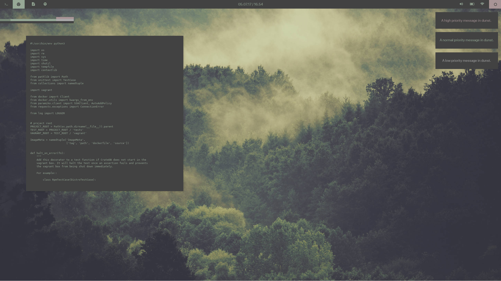

# Autophagy // Dotfiles

Purpose of this repo is to accumulate config files from playing around with
Arch in a VM, to prep for a fresh install. Also as an installer reminder for
when I get around to it.

## Theme

Simple, minimalist forest green theme.

## Configs

Should contain configs for:

 - i3-wm/i3-gaps
 - polybar
 - compton
 - zsh/oh-my-zsh
 - URxvt
 - dunst

## Reminders for Install

Things to install that don't really need a config:

 - GTK3 theme :: VimixDark-Laptop
 - GRUB theme :: Vimix
 - Icons :: numix (grey via numix-folders)
 - Display Manager :: SDDM with Abstract Dark Theme
 - Console fonts :: Droid Sans Mono
 - System font :: System San Francisco Display
