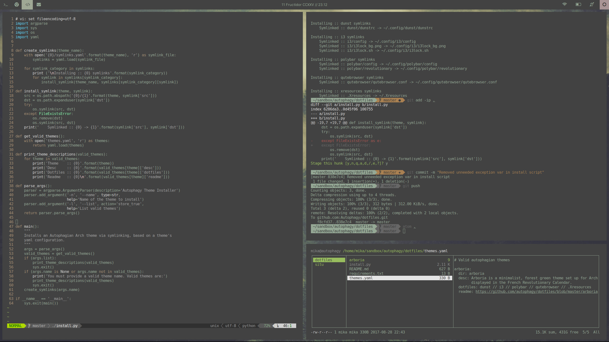

# Arboria :: Dotfiles

Arboria is a minimalist, forest green theme set up for
[Arch](https://www.archlinux.org/), with date displayed in the
[French Revolutionary Calendar](https://en.wikipedia.org/wiki/French_Republican_Calendar).

Work spaces are currently:  
1 :: terminal // 2 :: browser // 3 :: code // 4 :: comm // 5-9 :: free //
0 :: spotify

#### Clean

#### Busy

## Components Used

 - [i3wm-gaps](https://github.com/Airblader/i3) :: tiling window manager
 - [dunst](https://github.com/dunst-project/dunst) :: lightweight notification
   daemon
 - [polybar](https://github.com/jaagr/polybar) :: customisable statusbar (
   replaces i3-status)
 - [i3lock-color](https://github.com/chrjguill/i3lock-color) :: simple,
   customisable screen locker (replaces i3lock)

##  Requirements

 - fonts :: [Interface](https://rsms.me/interface/) // [FontAwesome](http://fontawesome.io/)
 - python :: [convertdate](https://pypi.python.org/pypi/convertdate/) for French
   Revolutionary date
 - [scrot](https://www.archlinux.org/packages/community/i686/scrot/) :: for
   printscrn
 - [rxvt-unicode](https://www.archlinux.org/packages/community/x86_64/rxvt-unicode/)
   :: terminal emulator

## Recommended

Also included is a config for [qutebrowser](https://www.qutebrowser.org/), a
vim-like browser.
